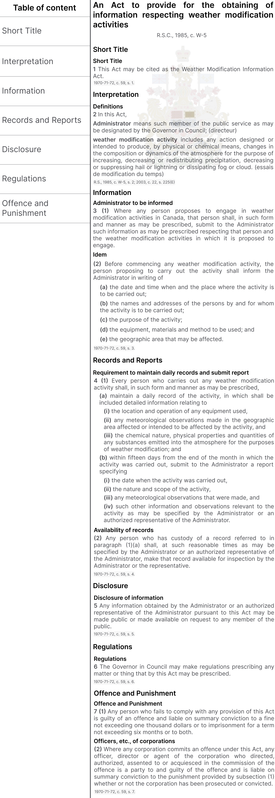
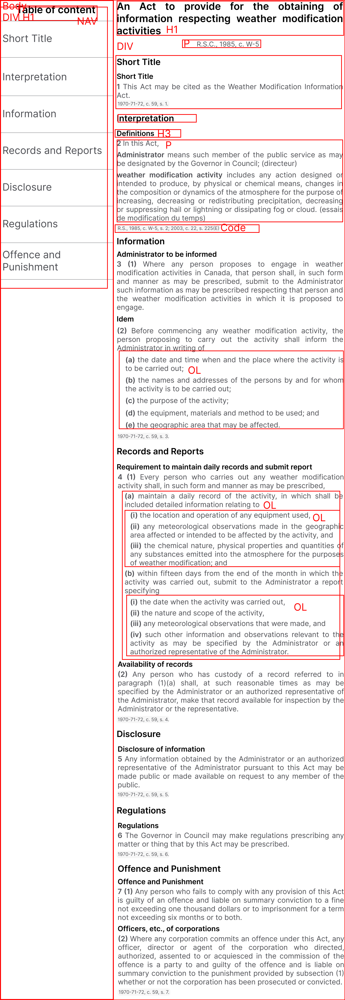

# Documentation page

This is the third project done to obtain the Free Code Camp Responsive Web Design certification.

[**Code Pen link**]()

<details>
  <summary>HTML code</summary>
  
```html

<!DOCTYPE html>
<html lang="en">
    <head>
        <meta charset="UTF-8" />
        <meta name="viewport" content="width=device-width, initial-scale=1.0" />
        <meta name="description" content="the full Weather Modification Information Act" />
        <title>Weather Modification Information Act</title>
        <link rel="stylesheet" href="styles.css" />
    </head>
    <body>
        <nav id="navbar">
            <header id="nav-header">Table of Content</header>
            <ul id="nav-bar-list">
                <li><a class="nav-link" href="#short_title">Short Title</a></li>
                <li><a class="nav-link" href="#interpretation">Interpretation</a></li>
                <li><a class="nav-link" href="#information">Information</a></li>
                <li><a class="nav-link" href="#records_and_reports">Records and Reports</a></li>
                <li><a class="nav-link" href="#disclosure">Disclosure</a></li>
                <li><a class="nav-link" href="#regulations">Regulations</a></li>
                <li><a class="nav-link" href="#offence_and_punishment">Offence and Punishment</a></li>
            </ul>
        </nav>
        <div id="main-text">
            <header class="intro-header">
                <h1>An Act to provide for the obtaining of information respecting weather modification activities</h1>
                <p id="law-reference" class="text">R.S.C., 1985, c. W-5</p>
            </header>
            <main id="main-doc">
                <section id="short_title" class="main-section">
                    <header>Short Title</header>
                    <p class="text"><b>Short Title</b></p>
                    <p class="text last"><b>1</b> This Act may be cited as the <i>Weather Modification Information Act</i>.</p>
                    <code>
                        1970-71-72, c. 59, s. 1.
                    </code>
                </section>
                <section id="interpretation" class="main-section">
                    <header>Interpretation</header>
                    <p class="text"><b>Definitions</b></p>
                    <p class="text"><b>2</b> in this Act,</p>
                    <p class="text">
                        <i><b>Administrator</b></i> means such member of the public service as may be designated by the 
                        Governor in Council; (<i>directeur</i>)
                    </p>
                    <p class="text last">
                        <i><b>weather modification activity</b></i> includes any action designed or intended to produce, by 
                        physical or chemical means, changes in the composition or dynamics of the atmosphere for the purpose 
                        of increasing, decreasing or redistributing precipitation, decreasing or suppressing hail or lightning or 
                        dissipating fog or cloud. (<i>essais de modification du temps</i>)
                    </p>
                    <code>
                        R.S., 1985, c. W-5, s. 2; 2003, c. 22, s. 225(E).
                    </code>
                </section>
                <section id="information" class="main-section">
                    <header>Information</header>
                    <p class="text"><b>Administrator to be informed</b></p>
                    <p class="text">
                        <b>3 (1)</b> Where any person proposes to engage in weather modification activities in Canada, 
                        that person shall, in such form and manner as may be prescribed, submit to the Administrator such information 
                        as may be prescribed respecting that person and the weather modification activities in which it is proposed to 
                        engage.
                    </p>
                    <p class="text"><b>Idem</b></p>
                    <p class="text">
                        <b>(2)</b> Before commencing any weather modification activity, the person proposing to carry out the activity 
                        shall inform the Administrator in writing of
                    </p>
                    <ol>
                        <li class="text main-list">
                            the date and time when and the place where the activity is to be carried out;
                        </li>
                        <li class="text main-list">
                            the names and addresses of the persons by and for whom the activity is to be carried out;
                        </li>
                        <li class="text main-list">
                            the purpose of the activity;
                        </li>
                        <li class="text main-list">
                            the equipment, materials and method to be used; and
                        </li>
                        <li class="text main-list last">
                            the geographic area that may be affected.
                        </li>
                    </ol>
                    <code>
                        1970-71-72, c. 59, s. 3.
                    </code>
                </section>
                <section id="records_and_reports" class="main-section">
                    <header>Records and Reports</header>
                    <p class="text"><b>Requirement to maintain daily records and submit report</b></p>
                    <p class="text">
                        <b>4 (1)</b> Every person who carries out any weather modification activity shall, in such form 
                        and manner as may be prescribed, 
                    </p>
                    <ol>
                        <li class="text main-list">
                            maintain a daily record of the activity, in which shall be included detailed 
                            information relating to
                            <ol class="sub-list-container">
                                <li class="text sub-list">
                                    the location and operation of any equipment used,
                                </li>
                                <li class="text sub-list">
                                    any meteorological observations made in the geographic area affected or intended to 
                                    be affected by the activity, and
                                </li>
                                <li class="text sub-list">
                                    the chemical nature, physical properties and quantities of any substances emitted into 
                                    the atmosphere for the purposes of weather modification; and
                                </li>
                            </ol>
                        </li>
                        <li class="text main-list">
                            within fifteen days from the end of the month in which the activity was carried 
                            out, submit to the Administrator a report specifying
                            <ol class="sub-list-container">
                                <li class="text sub-list">
                                    the date when the activity was carried out,
                                </li>
                                <li class="text sub-list">
                                    the nature and scope of the activity,
                                </li>
                                <li class="text sub-list">
                                    any meteorological observations that were made, and
                                </li>
                                <li class="text sub-list">
                                    such other information and observations relevant to the activity 
                                    as may be specified by the Administrator or an authorized representative 
                                    of the Administrator.
                                </li>
                            </ol>
                        </li>
                    </ol>
                    <p class="text"><b>Availability of records</b></p>
                    <p class="text last">
                        <b>(2)</b> Any person who has custody of a record referred to in 
                        paragraph (1)(a) shall, at such reasonable times as may be specified 
                        by the Administrator or an authorized representative of the Administrator, 
                        make that record available for inspection by the Administrator or the representative.
                    </p>
                    <code>1970-71-72, c. 59, s. 4.</code>
                </section>
                <section id="disclosure" class="main-section">
                    <header>Disclosure</header>
                    <p class="text"><b>Disclosure of information</b></p>
                    <p class="text last">
                        <b>5</b> Any information obtained by the Administrator or an authorized 
                        representative of the Administrator pursuant to this Act may be made 
                        public or made available on request to any member of the public.
                    </p>
                    <code>1970-71-72, c. 59, s. 5.</code>
                </section>
                <section id="regulations" class="main-section">
                    <header>Regulations</header>
                    <p class="text"><b>Regulations</b></p>
                    <p class="text last">
                        <b>6</b> The Governor in Council may make regulations prescribing any matter or 
                        thing that by this Act may be prescribed.
                    </p>
                    <code>1970-71-72, c. 59, s. 6.</code>
                </section>
                <section id="offence_and_punishment" class="main-section">
                    <header>Offence and Punishment</header>
                    <p class="text"><b>Offence and Punishment</b></p>
                    <p class="text">
                        <b>7 (1)</b> Any person who fails to comply with any provision of this Act is guilty 
                        of an offence and liable on summary conviction to a fine not exceeding one thousand 
                        dollars or to imprisonment for a term not exceeding six months or to both.
                    </p>
                    <p class="text"><b>Officers, etc., of corporations</b></p>
                    <p class="text last">
                        <b>(2)</b> Where any corporation commits an offence under this Act, any officer, director 
                        or agent of the corporation who directed, authorized, assented to or acquiesced in the 
                        commission of the offence is a party to and guilty of the offence and is liable on summary 
                        conviction to the punishment provided by subsection (1) whether or not the corporation has been 
                        prosecuted or convicted.
                    </p>
                    <code>1970-71-72, c. 59, s. 7.</code>
                </section>
            </main>
        </div>
    </body>
</html>

```

</details>

<details>
  <summary>CSS code</summary>
  
```css

html {
    margin: 0;
    box-sizing: border-box;
}

@media (prefers-reduced-motion: no-preference) {
    * {
      scroll-behavior: smooth;
    }
  }

  
* {
    box-sizing: inherit;
}

body {
    background-color: white;
    color: #000000;
    font-family: Arial, Helvetica, sans-serif;
    font-size: 16px;
    margin: 0;
    padding: 0;
    width: 100%;
    display: flex;
}

#nav-header {
    font-size: 1.5em;
    margin: 0;
    padding: 0.75em;
    width: 100%;
    text-align: left;
    vertical-align: middle;
    position: sticky;
    top: 0;
    background-color: white;
}

nav {
    margin: 0;
    min-width: 235px;
    max-width: 235px;
    height: 100vh;
    overflow: auto;
    border-right: 2px solid #99A2A2;
}

#main-text {
    /*width: calc(100% - 235px);*/
    width: auto;
    height: 100vh;
    min-width: 549px;
    overflow: auto;
}

#nav-bar-list {
    margin: 0;
    padding: 0;
    height: auto;
    list-style-type: none;
}

nav > ul > li:last-child {
    border-bottom: 1px solid #4D4E53;
}

h1 {
    margin: 0 auto;
    padding: 0.5% 2% 1% 2%;
    text-align: left;
    font-size: 32px;
    color: black;
}

.text {
    color: #4D4E53;
    font-size: 1em;
    text-align: left;
    margin: 0;
    padding: 0 2% 1% 2%;
    line-height: 1.65;
}

.last {
    padding: 0 2% 0 2%;
}

#law-reference {
    box-sizing: content-box !important;
    width: 147px;
    margin: 0 auto;
}

header:not(.intro-header) {
    font-size: 24px;
    font-weight:bold;
    color: black;
    margin: 0;
    padding: 0.5em 2% calc(0.5em + 1%) 2%;
}

.inline {
    display: inline !important;
}

b {
    color: black;
    font-weight: bold;
}

code {
    display: block;
    font-family: Arial, Helvetica, sans-serif;
    font-size: 0.75em;
    color: #4D4E53;
    text-align: left;
    margin: 0;
    padding: 0.5% 2% 1% 2%; 
}

ol {
    counter-reset: list;
    margin: 0;
}

ol > li {
    list-style: none;
    position: relative;
}

ol > li:before {
    counter-increment: list;
    font-weight: bold;
    color: black;
    
}

li.main-list:before {
    content: "(" counter(list, lower-alpha) ")";
}
 
li.sub-list:before {
    content: "(" counter(list, lower-roman) ")";
}

ol > li.main-list:first-child {
    padding: 0 2% 1% 2%;
}

li.sub-list:last-child {
    padding: 0 2% 0 2%;
}

ol.sub-list-container {
    margin-top: 1%;
    margin-bottom: 0.25%;
}

a {
    color: inherit;
    text-decoration: none;
    display: inline-block;
    text-align: left;
    width: 100%;
    vertical-align: middle;
    margin: 0;
    font-size: 1em;
    padding: 1em 0 1em 1.125em;
    color: #4D4E53;
    border-top: 1px solid #4D4E53;
}

nav > ul > li > a:hover {
    background-color: #4D4E53;
    color: white;
    padding: auto;
}

@media (max-width: 784px) {
    nav {
        position: absolute;
        width: 1px;
        height: 1px;
        padding: 0;
        margin: -1px;
        overflow: hidden;
        clip: rect(0, 0, 0, 0);
        white-space: nowrap;
        border: 0;
      }
  }

```

</details>


## Sketch


## High fidelity prototype



## HTML skeleton



## Final product


